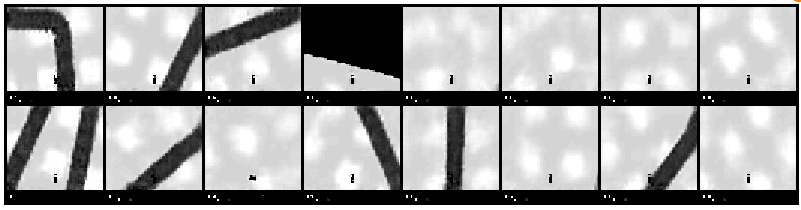
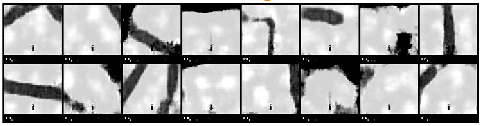
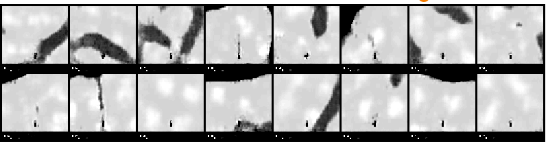
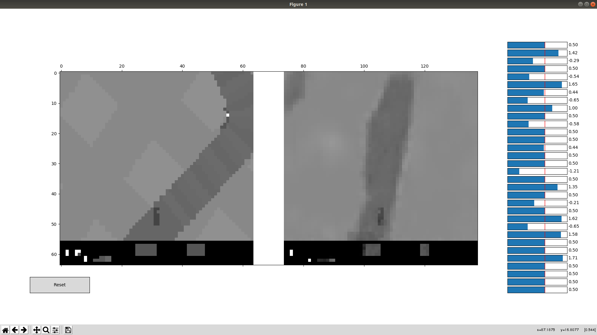

# World Models 

This repo contains a PyTorch implementation of World Models. It tries by all means to stay minimal and clear so that others won't face the troubles I've gone through ;) 

# VAE 

I trained the first World Models module: the Variational AutoEncoder. I really enjoyed this part, given that I find the theory underlying VAE really interesting and powerful, though they lack the sharpness you can reach using GANs. 

Here are some pictures of the results (reconstruction in the first picture and sampling for the last two)

## Visualisation 

I also made a visualisation tool using matplotlib. It shows both the original and reconstructed image and you have access to the code vector, so tweaking it actually changes the image. 

# TODO: 

* LSTM/GRU module
* RL/CMA-ES module 

# References : 

* [WorldModels](https://worldmodels.github.io)
